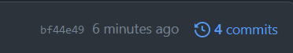
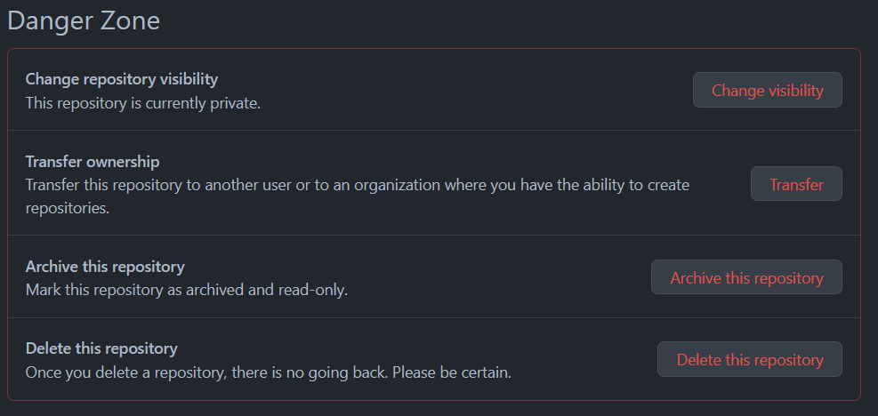
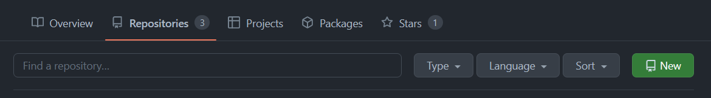
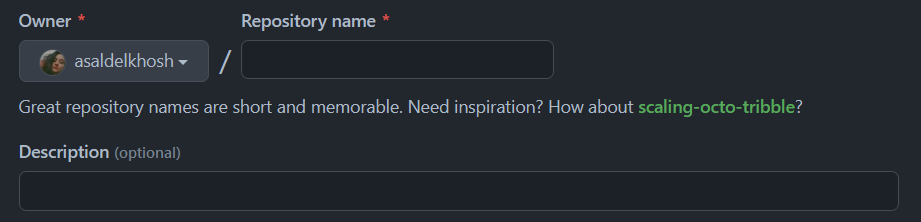
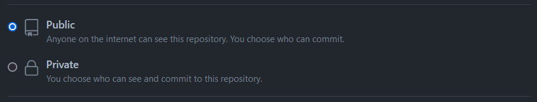
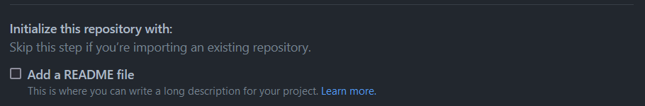
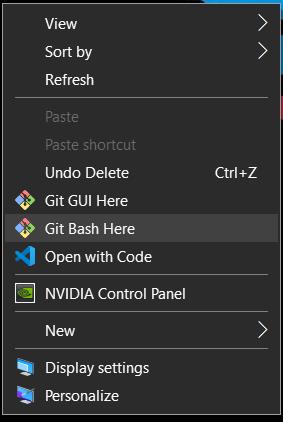
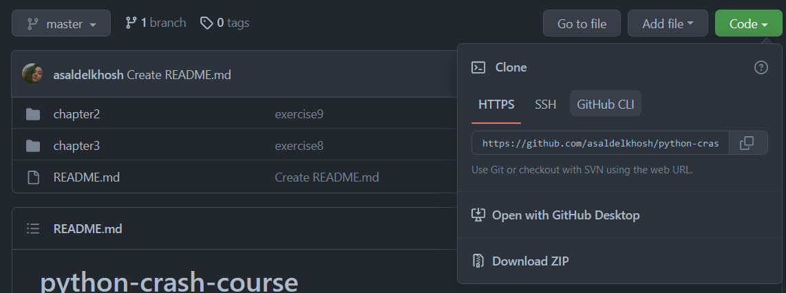

# Git Learning

Basic steps to use git and github.

<p align="center">
  
</p>

## Start using Git and Github

### [Basic level steps](#basic-level)
1. [Creating a Repository in Github](#creating-a-repository-in-github)
2. [Opening a bash (terminal, gitbash, ...)](#opening-a-bash)
3. [Clone the created repository into my computer](#clone-the-created-repository-into-my-computer)
4. [Adding my changes](#adding-my-changes)
5. [Commiting my changes](#commiting-my-changes)
6. [Pushing my changes into Github](#pushing-my-changes-into-github)

### [Advance level steps](#advance-level)
1. [Creating a Repository in Github](#creating-a-repository-in-github)
2. [Opening a bash (terminal, gitbash, ...)](#opening-a-bash)
3. [Create git files in my system](#create-git-files-in-my-system)
4. [Connecting my system git to Github repository](#connecting-my-system-git-to-github-repository)
5. [Pulling the Github data](#pulling-the-github-data)
6. [Adding everything to repository](#adding-everything-to-repository)
7. [Push everything to Github](#push-everything-to-github)

### Others
- [What is Star?](#what-is-star)
- [What is Fork?](#what-is-fork)
- [How can I see my commits?](#how-can-you-see-your-commits)
- [How can I change private repository to public?](#how-can-i-change-private-repository-to-public)

---

### What is Star?
If you like a repository, you can give an star to that repository. Just like giving a like to a post in instagram. You just have to click on the star logo.


---

### What is Fork?
You can copy someones repository into your own repositories by clicking the fork.


---

### How can you see your commits?
In your repository, click here:



---

### How can I change private repository to public?
Go to repository and go to _Settings_ section:


Scroll to bottom and to go this section:



Click change visibility and choose public mode, enter the repository and click what it says.

---

# How can I do it?

## Basic level

### Creating a Repository in Github
Open Github and go to _Repositories_ section, then click new.


You have to give your repository a name and a description.


In the next session you can choose your repository to be public (people will see this) or private (people won't see this).


You can create a _README.md_ for your repository, this file allows you to write some information about
your repository, so that other people can read it and undrestand the purpose of your repository.



Click the create button and we are done :D


### Opening a bash
If you are using *Windows* right click on the screen and choose _git bash_.<br />
If you are using *Linux / MacOS* right click on the screen and choose _open terminal_.



### Clone the created repository into my computer
Open your Github repository and copy the address from here:



You have to copy this:


Enter the following command:
```shell
git clone ADDRESS-FROM-GITHUB
```

### Adding my changes
When you made your changes, you have to add them by the following command:
```shell
git add .
```

### Commiting my changes
After you add your changes, you have to commit them with a message:
```shell
git commit -m "for example: add main.py file ..."
```

### Pushing my changes into Github
Now push your commits to the Github repository:
```shell
git push origin master
```

## Advance level

### Create git files in my system
Enter the following command:
```shell
git init
```

### Connecting my system git to Github repository
Open your Github repository and copy the address from here:


You have to copy this:


Now enter the following command to set the origin remote:
```shell
git remote add origin ADDRESS-FROM-GITHUB
```

### Pulling the Github data
Now enter the following command to pull the repository data:
```shell
git pull --allow-unrelated-histories ADDRESS-FROM-GITHUB
```

In case you stuck in _vim_, first click *esc* and then enter *:wq*.

### Adding everything to repository
You have to add everything to git repo:
```shell
git add .
```

And make a commit:
```shell
git commit -m "merge git repo"
```

### Push everything to Github
Push everything to github:
```shell
git push origin master
```
